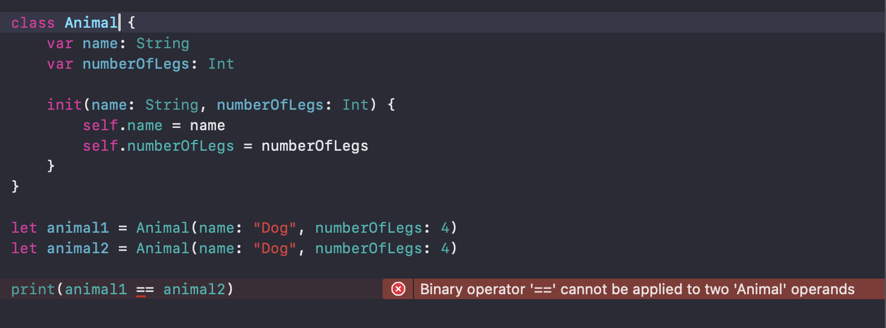
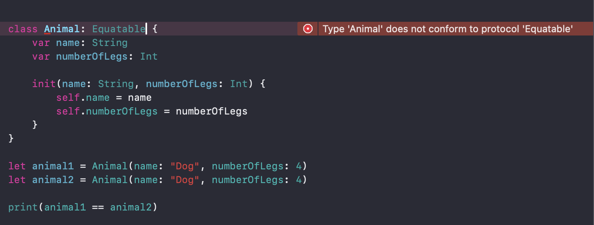
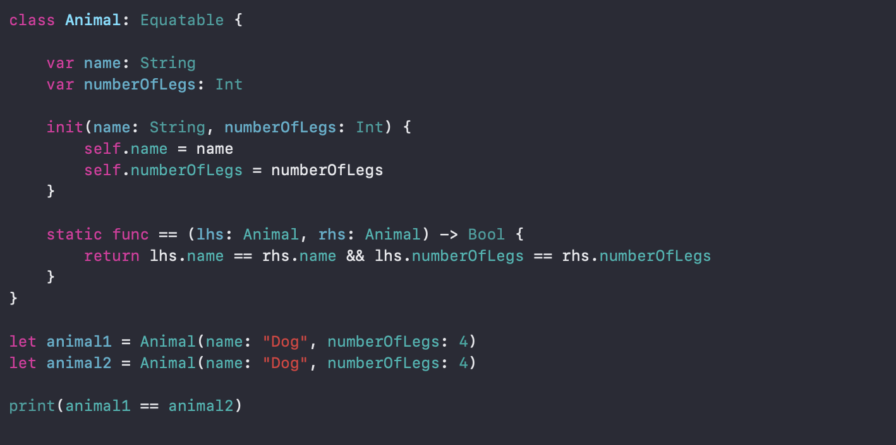

# Equatable


Here I’m going to try and explain what’s this `Equatable` protocol in Swift. First, let’s go to the basics.

## Basics

Whenever we try to compare two things like numbers or strings, we use `==` or `!=` , for example we say `2 == 2`  or `2 != 3`  

Numbers in Swift follow the `Equatable` protocol, that’s why Swift knows how to treat them when comparing, so, the next question would be..

## What’s `Equatable`?

Think of `Equatable` as a rulebook that tells Swift how to compare things to see if they are **equal** or **not equal.** When something like a `Int`, `String` or your custom object, follows the `Equatable` rulebook, Swift uses the `==` or `!=` to compare those things. So you don’t need more code to tell Swift how to treat those objects.

## Why is it useful?

In everyday life we often compare things:

- “Is this shoe the same size as that one?”
- “Are these numbers are equal?”

That also happens when we code, there are always things to compare when building our features in code, when our code becomes more and more complex, we need to start using other approaches to make your life easier.

When creating your own object, we can have something like this

```swift
struct Person {
    var name: String
    var age: Int
}
```

Now, when we try to compare those objects we are going to try and use `==` , and we get an error.


That’s why Swift doesn’t know yet how to treat these objects when comparing them, so we need to make our `Person` object conforms the `Equatable` protocol.

```swift
struct Person: Equatable {
    var name: String
    var age: Int
}

let person1 = Person(name: "Robert", age: 22)
let person2 = Person(name: "Robert", age: 22)

print(person1 == person2)
```

When doing this comparison, it is going to return true because name and age are the same.

Imagine you only want to compare these objects by just the `name` property, `Equatable` give us the change to customize the comparison, we need to add a function that tells Swift what we want to compare.

```swift
struct Person: Equatable {
    var name: String
    var age: Int

    static func == (lhs: Person, rhs: Person) -> Bool {
        return lhs.name == rhs.name // Compare only names
    }
}
```

So now, when comparing our Person object, Swift will tell us true only if both names are the same

```swift
let person1 = Person(name: "Robert", age: 25)
let person2 = Person(name: "Robert", age: 30)

print(person1 == person2) // true, because both names are the same
```

This is the behavior when using `Struct` , there is something different when using `Class` 

## What happens when using Classes?

Also in our daily life we don’t just use `Struct` when building code, we probably want to use `Class` depending on the use case.



Having this error, our next step would be to add the `Equatable` protocol to our class, but something happens here.



When using classes, Swift cannot synthesize the `Equatable` conformance for the `Animal` class because it’s a `class` and not a `struct` 

The main reason for this is that classes support **inheritance**, which make Equality more complex.

To fix this, we need to manually implement the `==` operator to our class to conform the `Equatable` protocol.



## One more thing for classes

### Reference Equality vs Value Equality

By default(without using `Equatable`) we can compare reference equality(`===`) between classes

```swift
let animal1 = Animal(name: "Dog", numberOfLegs: 4)
let animal2 = animal1

print(animal1 === animal2) // true, because they point to the same object
```

When using `Equatable` protocol, we are doing Value Equality, we ask Swift if the **contents are the same.**

> Take in consideration that if in your use case, if you don’t need to use inheritance you can choose to use `Struct`, Swift automatically synthesizes `Equatable` for structs if all their properties are `Equatable`.
> 

## Real life use cases

- Check if a list contains something

```swift
let people = [Person(name: "Alice", age: 25), Person(name: "Bob", age: 30)]
print(people.contains(Person(name: "Alice", age: 25))) // true
```

- Find duplicates in a list

```swift
let numbers = [1, 2, 3, 2, 4]
let uniqueNumbers = Set(numbers) // Removes duplicates
print(uniqueNumbers) // [1, 2, 3, 4]
```

## Conclusion

- `Equatable` lets you compare things using `==` and `!=`.
- Swift automatically handles it for simple types like numbers and text.
- For your own types, you can conform to `Equatable` and define custom comparison rules.
- It’s super helpful for working with lists, finding duplicates, or writing clear, simple comparisons in your code.